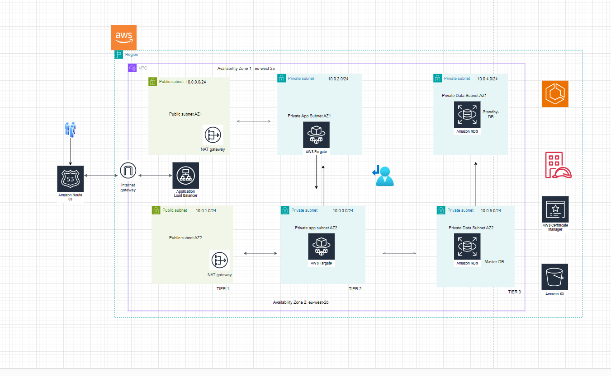

### README.md

```markdown
# AWS Terraform Multi-Tier Application

This repository contains Terraform configurations to deploy a multi-tier application on AWS. It includes modules for VPC, NAT Gateway, Security Groups, ECS Task Execution Role, ACM, ALB, and ECS Cluster.

## Prerequisites

- [Terraform](https://www.terraform.io/downloads.html) v0.12 or later
- AWS CLI configured with appropriate credentials
- An AWS account

## Project Structure

```plaintext
Aws-terraform-multi-tier-application
│
├── backend.tf
├── terraform.tfvars
├── main.tf
├── variables.tf
├── outputs.tf
├── modules
│   ├── vpc
│   │   ├── main.tf
│   │   ├── variables.tf
│   │   └── outputs.tf
│   ├── nat_gateway
│   │   ├── main.tf
│   │   ├── variables.tf
│   │   └── outputs.tf
│   ├── security-groups
│   │   ├── main.tf
│   │   ├── variables.tf
│   │   └── outputs.tf
│   ├── ecs-task-execution-role
│   │   ├── main.tf
│   │   ├── variables.tf
│   │   └── outputs.tf
│   ├── acm
│   │   ├── main.tf
│   │   ├── variables.tf
│   │   └── outputs.tf
│   ├── alb
│   │   ├── main.tf
│   │   ├── variables.tf
│   │   └── outputs.tf
│   └── ecs-cluster
│       ├── main.tf
│       ├── variables.tf
│       └── outputs.tf
```

## Getting Started

### 1. Clone the Repository

```sh
git clone https://github.com/m-pasima/Aws-terraform-multi-tier-application.git
cd Aws-terraform-multi-tier-application
```

### 2. Configure Backend

Update the `backend.tf` file with your backend configuration (e.g., S3 bucket for remote state storage).

### 3. Set Variables

Update the `terraform.tfvars` file with your specific values. Example:

```hcl
region                  = "eu-west-2"
project_name            = "my-project"
vpc_cidr                = "10.0.0.0/16"
public_subnet_az1_cidr  = "10.0.1.0/24"
public_subnet_az2_cidr  = "10.0.2.0/24"
private_app_subnet_az1_cidr = "10.0.3.0/24"
private_app_subnet_az2_cidr = "10.0.4.0/24"
private_data_subnet_az1_cidr = "10.0.5.0/24"
private_data_subnet_az2_cidr = "10.0.6.0/24"
domain_name             = "example.com"
alternative_name        = "www.example.com"
```

### 4. Initialize Terraform

Initialize the Terraform configuration:

```sh
terraform init
```

### 5. Plan the Deployment

Run Terraform plan to see the changes that will be applied:

```sh
terraform plan
```

### 6. Apply the Configuration

Apply the Terraform configuration:

```sh
terraform apply
```

### 7. Clean Up

To destroy the infrastructure created by Terraform, run:

```sh
terraform destroy
```

## Module Descriptions

### VPC Module

Handles the creation of the VPC, subnets, and associated resources.

**`modules/vpc/main.tf`**

```hcl
resource "aws_vpc" "main" {
  cidr_block = var.vpc_cidr
  ...
}
```

### NAT Gateway Module

Creates NAT Gateways for the public subnets.

**`modules/nat_gateway/main.tf`**

```hcl
resource "aws_eip" "eip_for_nat_gateway_az1" {
  domain = "vpc"
  ...
}
resource "aws_nat_gateway" "nat_gateway_az1" {
  allocation_id = aws_eip.eip_for_nat_gateway_az1.id
  subnet_id     = var.public_subnet_az1_id
  ...
}
```

### Security Groups Module

Creates security groups for the application.

**`modules/security-groups/main.tf`**

```hcl
resource "aws_security_group" "alb_sg" {
  vpc_id = var.vpc_id
  ...
}
```

### ECS Task Execution Role Module

Creates the IAM role for ECS tasks.

**`modules/ecs-task-execution-role/main.tf`**

```hcl
resource "aws_iam_role" "ecs_tasks_execution_role" {
  name               = "${var.project_name}-ecs-task-execution-role"
  assume_role_policy = ...
}
```

### ACM Module

Handles the creation of ACM certificates.

**`modules/acm/main.tf`**

```hcl
resource "aws_acm_certificate" "acm_certificate" {
  domain_name               = var.domain_name
  ...
}
```

### ALB Module

Creates the Application Load Balancer.

**`modules/alb/main.tf`**

```hcl
resource "aws_lb" "application_load_balancer" {
  name               = "${var.project_name}-alb"
  ...
}
```

### ECS Cluster Module

Handles the creation of ECS cluster, task definitions, and services.

**`modules/ecs-cluster/main.tf`**

```hcl
resource "aws_ecs_cluster" "ecs_cluster" {
  name = "${var.project_name}-cluster"
  ...
}
resource "aws_ecs_task_definition" "ecs_task_definition" {
  family = "${var.project_name}-task-definition"
  ...
}
resource "aws_ecs_service" "ecs_service" {
  name            = "${var.project_name}-service"
  cluster         = aws_ecs_cluster.ecs_cluster.id
  ...
}
```

## Diagram

Here is a graphical representation of the folder structure:

```
Aws-terraform-multi-tier-application
│
├── backend.tf
├── terraform.tfvars
├── main.tf
├── variables.tf
├── outputs.tf
├── modules
│   ├── vpc
│   │   ├── main.tf
│   │   ├── variables.tf
│   │   └── outputs.tf
│   ├── nat_gateway
│   │   ├── main.tf
│   │   ├── variables.tf
│   │   └── outputs.tf
│   ├── security-groups
│   │   ├── main.tf
│   │   ├── variables.tf
│   │   └── outputs.tf
│   ├── ecs-task-execution-role
│   │   ├── main.tf
│   │   ├── variables.tf
│   │   └── outputs.tf
│   ├── acm
│   │   ├── main.tf
│   │   ├── variables.tf
│   │   └── outputs.tf
│   ├── alb
│   │   ├── main.tf
│   │   ├── variables.tf
│   │   └── outputs.tf
│   └── ecs-cluster
│       ├── main.tf
│       ├── variables.tf
│       └── outputs.tf
```

## Conclusion

This repository provides a structured way to deploy a multi-tier application on AWS using Terraform. Follow the steps provided to set up and deploy your infrastructure efficiently.
```

This README provides a comprehensive guide to setting up and using the `Aws-terraform-multi-tier-application` repository, including the project structure, initialization steps, and module descriptions.